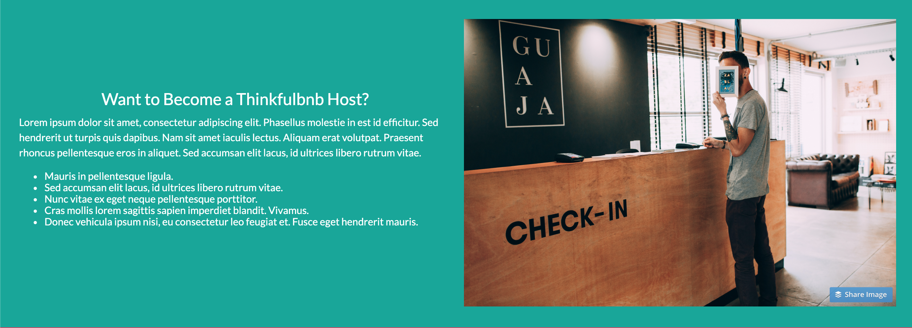

# Thinkfulbnb
This project tested my knowledge on HTML and CSS.\ 
From creating input fields in HTML to creating responsive images and media querys to make the webpage responsive.\
I enjoyed this project because it was my first proper step into Web Development.\

- Used HTML and CSS to format a website to display correctly on desktops, tablets , and phones.
Created a page layout using flexbox.
- Implemented media queries for responsive design.
- Mobile-first development.
- Built with: HTML, CSS.

## Mobile view
### This is the Mobile View of the webpage.

## Desktop view
### This is the Desktop View of the webpage.

## Files

| File         | Description                                                             |
| ------------ | ----------------------------------------------------------------------- |
| `images/`    | A folder containing all the images used for the design.                 |
| `index.html` | The HTML file that contains all the code for the inputs, drop down menus and buttons.|
| `style.css`  | The CSS file that containts all the formating for the project.|

### Navigation

- **Single-page navigation**: Created navigation links so that clicking on each link you would be taken to the corresponding section on the page:

- In the "Find your perfect vacation rental" section, created a form that contains the following input fields with the specified types:

  - `Location`: `text` input type, with a placeholder value of "Search destination"
  - `Arrive`: `date` input type
  - `Depart`: `date` input type
  - `Type`: a dropdown list with the following options:
    - Apartment
    - Barn
    - Castle
    - Houseboat
    - Tiny House
    - Yacht
    - Yurt
  - a `"Search"` button

### Responsive images

- Wrote CSS so that all images will match whatever container width they are placed within, and changing the container sizes will update the image sizes appropriately.

